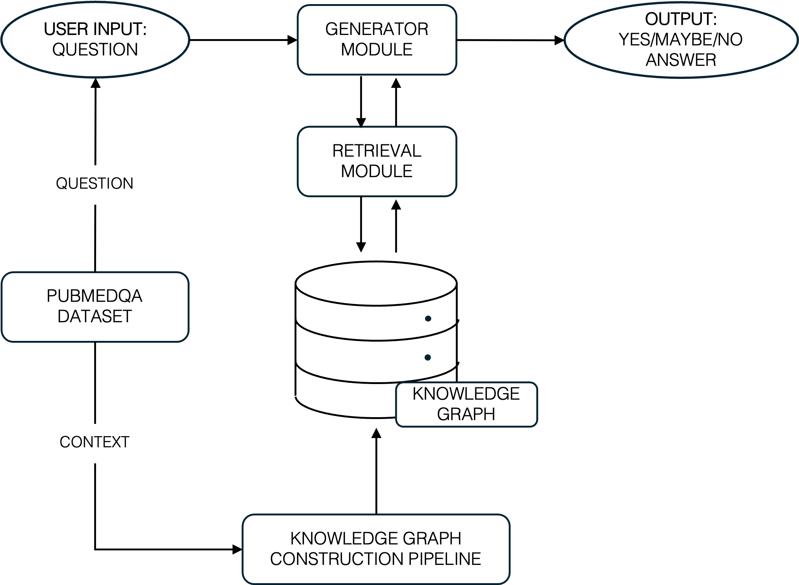
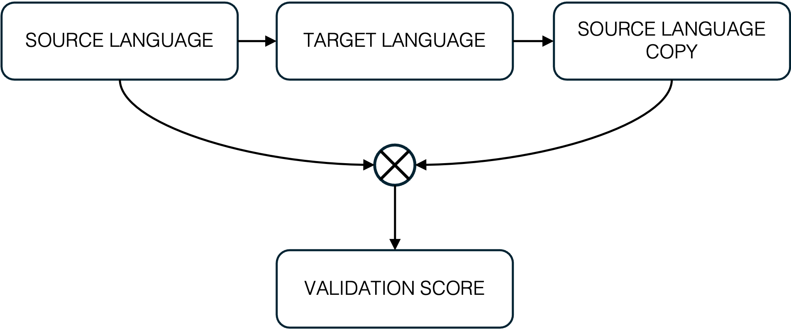

# 2026-T-Elliott-MSc-Dissertation – *Addressing Biomedical Literature Overload through Knowledge Graph Generation and Agentic Reasoning*

## Authors
**Student:** Taine J. Elliott
**Supervisor:** Dr. Martin Bekker
**Co-Supervisors:** Dr. Stephen Levitt, Dr. Ken Nixon


## Abstract

*Biomedical literature is growing at an unprecedented rate. As a result, researchers are likely to struggle keeping up with the growing volume. Current biomedical literature search tools retrieve large volumes of results, but lack the ability to deliver precise, context-aware answers. This work extends and contributes to research in information extraction for knowledge graph generation and knowledge graph retrieval augmented generation (graphRAG), with the goal of connecting all biomedical literature through units of knowledge. The work documents how a knowledge graph of propositions is built using 350 biomedical abstracts from the PubMedQA dataset. During construction, a back-translation methodology for validation was pioneered. Once constructed, questions derived from the dataset were answered using the knowledge graph with both single-iteration and recursive retrieval approaches. The system's performance was compared to a baseline (where the latter had access to the full context prior to graph generation). Through back-translation, the average cosine similarity between the reconstructed abstracts of propositions and the original abstracts was 0.913. The cosine similarity distribution was calibrated against the Semantic Textual Similarity Benchmark (STS-B), showing that reconstructed abstracts were completely equivalent to the original texts. Answers derived from the knowledge graph achieved 93.03\% of the baseline F1 score with single-iteration retrieval, and 86.07\% with recursive retrieval. This performance implies that knowledge graphs are capable of storing biomedical knowledge faithfully, and that they enable precise retrieval for effective reasoning. Ultimately, this dissertation demonstrates that biomedical literature can be captured in knowledge graph form, can effectively be reasoned with, signalling how researchers might better navigate vast quantities of biomedical knowledge.*

📄 **Full dissertation PDF**: [paper/Taine_Elliott_MSc_Dissertation.pdf](paper/Taine_Elliott_MSc_Dissertation.pdf)

---
## Table of Contents
1. [Project Overview](#project-overview)
2. [Repository Layout](#repository-layout)
3. [Quick Start](#quick-start)
4. [Backend (set-up & usage)](#backend)
   * [Chapter 3 — Knowledge Graph Generation](#chapter-3--knowledge-graph-generation)
   * [Chapter 4 — GraphRAG](#chapter-4--graphrag)
5. [Frontend (set-up & usage)](#frontend)
6. [Datasets](#datasets)

---
## Project Overview
This dissertation demonstrates how a **knowledge‑graph** can improve question‑answering performance when paired with **Retrieval‑Augmented Generation (RAG)** when knowledge is decomposed into propositions.  Two Django apps work together as a pincer by extracting the context from the PubMedQA dataset to seed the knolwedge graph and thereafter using the questions in the PubMedQA dataset to determine how effectively that knowledge graph can be reasoned with. Chapter 3 Figure 3.2 below gives an overview of this system architecture.
<p align="center">
  
</p>

---
## Repository Layout
```
└── 2026-T-Elliott-MSc/
    ├── backend/                  # Django project
    │   ├── knowledge-graph-generator/
    │   └── graphRAG/
    ├── frontend/                 # React (Vite) SPA
    ├── data/                     # Raw & processed datasets
    │   ├── pubmed_papers/
    │   └── pubmedqa/
    ├── environment.yml           # Conda spec (see below)
    ├── .env.example              # Template for secrets & config
    └── README.md                 # You are here
```

---
## Quick Start
You will initially need to install a NEO4J graph database which will run on port bolt://localhost:7687 and update the .env variable to include the name and password of that graph database. The graph database will be used during post-processing in Chapter 1 and throughout Chapter 2.

```bash
# 1. clone the repo
git clone https://github.com/witseie-students/2026-T-Elliott-MSc.git
cd 2026-T-Elliott-MSc

# 2. create the Conda environment (Python 3.11)
pip install -r requirements.txt

# 3. Obtain an OpenAI api key and edit the .env variable inside of backend

# 4. apply migrations & run the API
cd backend
python manage.py migrate
python manage.py runserver 0.0.0.0:8000

# 5. In a new terminal create the vector store
python manage.py 000_initiate_chroma_vectors


```

---
## Datasets
* **PubMedQA** – PubMed abstracts are broken down into title , content and conclusion. The title is converted into a question which has an answer that is *yes*, *maybe*, or *no*. The content which includes background, methods, and results is used to seed the knowledge graph. The conclusion is considerred a long answer to the question but is not considered for this dissertation (Chapter 3). 
* **PubMed Statistics** – CSV containing yearly publication counts used for exploratory analysis between January of 1965 and June of 2025 (Chapter 2).


---
## Backend
The following code snippets run in parallel with the dissertation while the django server is running in a different teriminal.

### Chapter 3 — Knowledge Graph Generation
The main orchestration for this pipeline is exposed through the API endpoint
`process_paragraph_parallel/`, defined in
`backend/knowledge_graph_generator/urls.py` and handled by
`ProcessParagraphParallelView(APIView)` in
`backend/knowledge_graph_generator/views.py`.

#### 1. Running the entire pipeline to populate the database with the knolwedge graph for all 350 abstracts
```bash
# run full pipeline
python manage.py 000_run_all_350_abstracts_and_save_to_database
```

#### 2. Pre-processing

The preprocessing strategy involves decomposing knolwedge into propositions and then applying coreference resolution upon the entire batch of propositions. The specific functions to do so can be found in `backend/knowledge_graph_generator/pipeline_utilities/propositions.py` and `backend/knowledge_graph_generator/pipeline_utilities/coreferences.py`


#### 3. Information extraction

The information extraction of triples and derived questions from those triples can be found in `backend/knowledge_graph_generator/pipeline_utilities/triple_extraction.py` and `backend/knowledge_graph_generator/pipeline_utilities/triple_question.py`.

#### 4. Validation

The validation strategy used involved back-translation which can be seen in the diagram below. Back-translation implicity evaluates the fidelity of information extraction.
<p align="center">
  
</p>
Initially, propositions are compared against triples to determine which unit representation has the highest fidelity. Thereafter, the triples extracted from the propositions are compared against the propositions themselves. Finally, the entire information loss is evaluated at each stage.

##### 1. Propositions vs Triples
The following two management commands should be run to extract the results and save them to the folder: `results/00_fully_organized_results/01_triple_vs_propositions`.
```bash
# Extract triples from each abstract
python manage.py 000_compare_triples_to_propositions_at_abstract_level

# Save the extracted propositions to the results folder
python manage.py 000_export_combined_propositions_to_compare_with_triples_at_abstract_level
```

##### 2. Validation of Extracted triples
The following management command extracts triples from the database which were extracted for each of the propositions and saves them to the folder: `results/00_fully_organized_results/02_grouped_triples_and_question_extraction_(not_combined)`.
```bash
# Extract triples from each proposition and save results to the directory
python manage.py 000_triple_qa_results_per_proposition
```
The results can then be decoupled and evaluated when 1, 2 and 3+ propositions are extracted and back-translated individually compared to when they are back-translated together. This occurs in folder `results/00_fully_organized_results/02_grouped_triples_and_question_extraction_(not_combined)` and `results/00_fully_organized_results/03_grouped_triples_and_question_extraction_combined`.

##### 3. Information Loss at each stage

The following management command extracts the back-translated similarity at each stage of transformation starting with proposition chunking, then coreference resolution and finally extracted (and recombined) back-translated triples against the abstract from which they were derived. The results are then saved to the folder: `results/00_fully_organized_results/04_overall_system_results`.

```bash
# Extract and combine transformations at each stage to compare to the original abstract
python manage.py 000_information_loss_at_each_stage
```


##### 4. Benchmark evaluation of results
The creation of the benchmark to evaluate cosine similarity against the *STS-B* bins can be found in `results/00_fully_organized_results/00_benchmark`and the rest of the code regarding each of the validation tests can be found in the order it is represented in the dissertation in.


#### 5. Post-processing
During the extraction process the extracted triples and propositions are saved to a staging database which enables an audit trail in the case of errors being made. Inferring new relationships between locally extracted entities occurs in the file: `backend/knowledge_graph_generator/pipeline_utilities/triple_extraction.py`and  entity mapping occurs in the file: `backend/knowledge_graph_generator/chroma_db/entity_mapping.py` which works in tandem with the database to enable new and previously canonicalized entites.


### Chapter 4 — GraphRAG

This section uses the neo4j database of propositions connected by entities within them in conjunction with the questions and answers to those questions which is found in the 350 abstracts within the PubMedQA dataset to show different performance of different RAG architectures. Initially, a baseline is determined. Thereafter, different retrieval methodologies are explored. Finally, different reasoning methodologies are explored.

#### 1. Creating a baseline

The upperbound baseline and lowerbound baseline are created by running the following code. Where randomness represents the lowerbound baseline.

```bash
# Run upper-bound baseline
python manage.py 000_upper_bound_baseline

# run lower-bound baseline
python manage.py 000_test_randomness
```

The results are saved to the folder `results/01_graphrag/02_upper_bound` whilst randomness generates an average performance.

#### 2. Evaluating different retrieval architectures

Initially ordinary RAG is tested using the following command
```bash
# Run ordinary RAG
python manage.py 000_ordinary_rag
```

The results are saved to the folder: `results/01_graphrag/01_ordinary_rag`. Thereafter, dynamic graph traversal is explored using the following command:

```bash
# Run dynamic graphRAG
python manage.py 000_dynamic_graphrag
```
The results are saved to the folder: `results/01_graphrag/03_ordinary_graphrag`. Finally, static graphRAG is performed with different depths.

```bash
# Run static graphRAG
python manage.py 000_alg_graphrag
```
The results are saved to the folder: `results/01_graphrag/04_alg_graphrag`. 

#### 3. Evaluating different reasoning architectures

It became clear that algorithmic graphRAG had the strongest performance. Therefore, that is used as the chosen retrieval architecture. Using a ReAct style architecture, first Chain of Thoughts (CoT) is examined using the following command:
```bash
# Run CoT graphRAG
python manage.py 000_cot_loop
```
The results are saved to the following folder `results/01_graphrag/05_cot_graphrag`. Thereafter, Tree of Thoughts is performed using the following command:
```bash
# Run ToT graphRAG
python manage.py 000_tot_loop
```
The results are saved to the following folder `results/01_graphrag/06_tot_graphrag`. Thereafter, the null-hypotheis is explored and a baseline for the null-hypothesis is created. This is performed using the following command:
```bash
# Run null hypothesis baseline
python manage.py 000_baseline_null_hypothesis

# Run ToT null hypothesis graphRAG
python manage.py 000_tot_null_hypothesis
```
the results are saved to the following folders `results/01_graphrag/09_baseline_null` and `results/01_graphrag/07_tot_null_hypothesis`. Finally, the null-hypothesis is run with a rumsfled matrix. This is performed using the following command: 
```bash
# Run ToT null hypothesis graphRAG with rumsfled matrix
python manage.py 000_tot_rumsfled
```
The results are saved to the following folder: `results/01_graphrag/08_tot_rumsfeld`.


---
## Frontend
* React 18 + Vite + TypeScript
* Chakra UI (component library)
* Axios (API client)
* React Router

```bash
# development hot-reload
npm run dev

# production build
npm run build && npm run preview
```

The app is pre-configured to proxy `/api/*` to `localhost:8000` in development.


